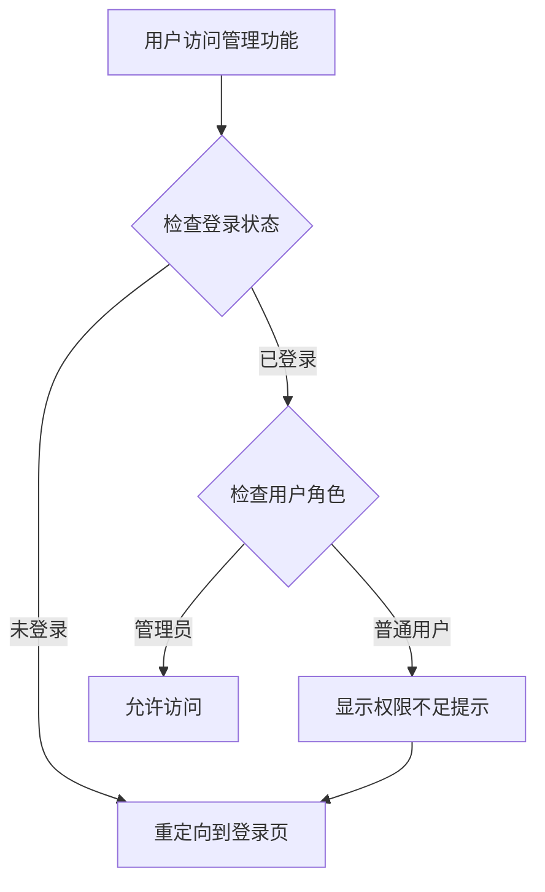

# ByteForge 权限系统说明

## 🔐 权限架构

### 用户角色

系统支持两种用户角色：

1. **普通用户 (`user`)**
   - 可以浏览公开内容
   - 可以提交反馈
   - **不能**访问管理后台

2. **管理员 (`admin`)**
   - 拥有所有普通用户权限
   - 可以访问管理后台
   - 可以管理用户、内容、反馈等

## 🛡️ 权限保护层级

### 第一层：前端导航限制

**导航中心 (`/nav.html`)**
- 非管理员用户看到的 Admin 卡片会被禁用
- 卡片显示效果：
  - 灰度滤镜 + 半透明
  - 标题显示 `Admin 🔒`
  - 点击时弹出提示：`⚠️ 访问受限`
  - 鼠标悬停提示：`仅限管理员访问`

```javascript
// 权限检测逻辑
const userData = JSON.parse(localStorage.getItem('user'));
const isAdmin = userData.role === 'admin';

if (!isAdmin) {
  // 禁用管理后台卡片
  adminCard.style.opacity = '0.4';
  adminCard.style.pointerEvents = 'none';
  adminCard.style.filter = 'grayscale(1)';
}
```

### 第二层：页面级权限验证

**管理后台页面 (`/admin.html` 和 `/admin-v2.html`)**
- 页面加载前立即执行权限检查
- 检查失败时的处理：
  1. 显示警告弹窗
  2. 自动重定向到登录页
  3. 保留原始访问路径用于登录后跳转

```javascript
// 页面级保护（在 <head> 中同步执行）
if (userData.role !== 'admin') {
  alert('⚠️ 访问受限\n\n此页面仅限管理员访问。\n请使用管理员账号登录。');
  window.location.href = '/login.html?redirect=/admin-v2.html';
}
```

### 第三层：API 权限验证（后端）

**API 端点保护**
- 所有管理 API 都需要验证 JWT token
- 检查 token 中的用户角色
- 非管理员请求返回 `403 Forbidden`

```javascript
// 后端 API 权限中间件示例
if (user.role !== 'admin') {
  return { error: 'forbidden', message: '需要管理员权限' };
}
```

## 🎯 权限判断流程



## 📋 权限检查点列表

### ✅ 已实现的保护

| 位置 | 保护方式 | 失败处理 |
|------|----------|----------|
| 导航中心 - Admin 卡片 | JavaScript 禁用 | 点击提示 + 阻止跳转 |
| `/admin.html` | 页面加载前检查 | 弹窗提示 + 重定向登录 |
| `/admin-v2.html` | 页面加载前检查 | 弹窗提示 + 重定向登录 |
| 管理 API 端点 | JWT + 角色验证 | 返回 403 错误 |

### 🔄 权限刷新机制

用户信息存储在 `localStorage` 中：
- `auth_token` - JWT 访问令牌
- `refresh_token` - 刷新令牌
- `user` - 用户信息（包含 `role`）

登录成功时，后端返回：
```json
{
  "ok": true,
  "token": "eyJhbGciOiJIUzI1Ni...",
  "refreshToken": "eyJhbGciOiJIUzI1Ni...",
  "user": {
    "id": 1,
    "username": "admin",
    "email": "admin@example.com",
    "role": "admin"
  }
}
```

## 🔍 如何验证权限系统

### 测试场景 1：普通用户访问管理后台

1. 使用普通用户账号登录
2. 访问 `/nav.html`
3. **预期结果**：
   - Admin 卡片显示为灰色 + 锁定图标
   - 点击后弹出提示，无法进入

### 测试场景 2：直接访问管理页面

1. 未登录状态下直接访问 `/admin-v2.html`
2. **预期结果**：
   - 弹出 "访问受限" 提示
   - 自动跳转到 `/login.html?redirect=/admin-v2.html`
   - 登录成功后返回管理页面

### 测试场景 3：管理员正常访问

1. 使用管理员账号登录
2. 访问 `/nav.html`
3. **预期结果**：
   - Admin 卡片正常显示
   - 区域标题显示 "● AUTHORIZED" 标记
   - 可以正常进入管理后台

## 🚨 安全注意事项

### ⚠️ 前端验证局限性

前端权限检查**只是用户体验优化**，不能作为安全保障：
- 用户可以通过浏览器开发工具绕过前端检查
- 真正的安全保护**必须在后端实现**

### ✅ 安全最佳实践

1. **后端验证是核心**
   - 所有管理 API 必须验证 JWT
   - 检查用户角色
   - 记录敏感操作日志

2. **Token 安全**
   - 使用 HTTPS 传输
   - 设置合理的过期时间
   - 实现 Token 刷新机制

3. **权限粒度**
   - 按功能模块划分权限
   - 支持更细粒度的角色（如编辑、审核员等）
   - 实现权限矩阵

## 📊 权限状态可视化

### 导航中心显示逻辑

```
未登录状态：
[🔐 Login]  [⚙️ Admin 🔒]  ← Admin 卡片灰色锁定

普通用户登录：
[👤 Account]  [⚙️ Admin 🔒]  ← Admin 卡片灰色锁定

管理员登录：
[👤 Account]  [⚙️ Admin]  ← Admin 卡片正常显示
SYSTEM ADMIN ● AUTHORIZED  ← 区域标题显示授权标记
```

## 🔑 如何创建管理员账号

管理员账号需要通过以下方式创建：

1. **数据库直接设置**
   ```sql
   UPDATE users SET role = 'admin' WHERE username = 'your_username';
   ```

2. **首次注册自动成为管理员**（如果配置了）
   - 第一个注册的用户自动获得管理员权限

3. **通过现有管理员提升**
   - 在管理后台的用户管理中修改角色

---

**安全提示**：前端验证提升用户体验，后端验证保障系统安全！
