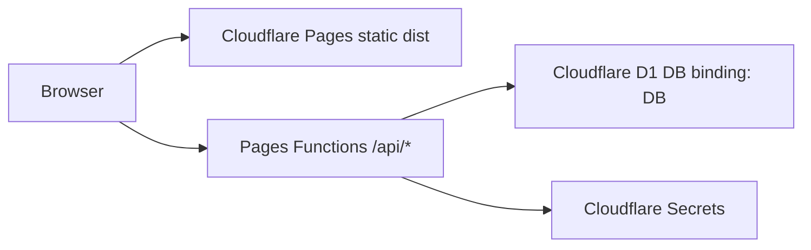

# ByteForge Backend Production Guide

## Goal

ByteForge uses a small production backend on Cloudflare Pages Functions and D1.
The backend stores feedback, content interaction events, users, settings, and
admin analytics without introducing a separate server or temporary service.

## Architecture



Core boundaries:

- `functions/api/`: route handlers.
- `functions/lib/http.js`: JSON responses, CORS allowlist, safe error responses.
- `functions/lib/auth.js`: PBKDF2 password hashing, JWT signing and auth checks.
- `schema/d1.sql`: D1 schema and indexes.
- `wrangler.toml`: non-secret runtime configuration.
- `.dev.vars`: local-only secrets.

## Runtime Configuration

Required non-secret variables:

| Name | Purpose | Example |
| --- | --- | --- |
| `SITE_ORIGIN` | Canonical production origin | `https://byteforge.dev` |
| `ALLOWED_ORIGINS` | Comma-separated CORS allowlist | `https://byteforge.dev` |

Required secret:

| Name | Purpose |
| --- | --- |
| `JWT_SECRET` | HMAC key for session tokens |

Set production secret:

```powershell
pnpm exec wrangler secret put JWT_SECRET
```

Local `.dev.vars`:

```text
JWT_SECRET=replace-with-a-long-random-local-secret
SITE_ORIGIN=http://localhost:8788
ALLOWED_ORIGINS=http://localhost:5173,http://localhost:8788
```

## Database

`schema/d1.sql` is valid SQLite/D1 SQL. Indexes are standalone
`CREATE INDEX IF NOT EXISTS` statements, not inline table declarations.

Tables:

| Table | Purpose |
| --- | --- |
| `users` | Login accounts and roles |
| `settings` | Site/admin settings |
| `sessions` | Reserved for server-side session revocation |
| `rate_limits` | Global API rate-limit counters |
| `refresh_tokens` | Long-lived refresh tokens |
| `feedback` | User feedback tied to routes/documents |
| `content_events` | Analytics events: `view`, `click`, `search`, `share` |

Apply schema:

```powershell
pnpm exec wrangler d1 execute byteforge --file=./schema/d1.sql
```

## Authentication

Passwords use PBKDF2-SHA256 with per-password random salt:

```text
pbkdf2_sha256$iterations$salt$hash
```

JWTs are signed with `env.JWT_SECRET`. The first registered user becomes
`admin`; later users become `user`. Admin APIs require a bearer token from an
active admin account.

Authorization header:

```text
Authorization: Bearer <token>
```

## API Surface

Public endpoints:

| Method | Path | Purpose |
| --- | --- | --- |
| `GET` | `/api/health` | Health check |
| `POST` | `/api/feedback` | Store public feedback |
| `POST` | `/api/content-events` | Store content analytics events |

Auth endpoints:

| Method | Path | Purpose |
| --- | --- | --- |
| `POST` | `/api/auth/register` | Create user and return token |
| `POST` | `/api/auth/login` | Login and return token |
| `GET` | `/api/auth/me` | Return current user |
| `POST` | `/api/v1/auth/refresh` | Exchange refresh token for a new access token |

Rate limiting is implemented in `functions/_middleware.js` for `/api/*`
routes. `/api/health` is intentionally skipped; use an authenticated endpoint
such as `/api/auth/me` when manually verifying 15-minute/100-request limits.

Admin endpoints:

| Method | Path | Purpose |
| --- | --- | --- |
| `GET` | `/api/admin/analytics` | Aggregate dashboard stats |
| `GET` | `/api/admin/content-stats` | Per-document analytics |
| `GET` | `/api/admin/feedback` | Feedback list |
| `DELETE` | `/api/admin/feedback/delete/:id` | Delete feedback |
| `GET` | `/api/admin/settings` | Read settings |
| `PUT` | `/api/admin/settings` | Update settings |
| `GET` | `/api/admin/users` | List users |
| `PATCH` | `/api/admin/users` | Activate users and change roles |

## CORS And Errors

CORS is allowlist-based. `Access-Control-Allow-Origin: *` is not used in API
code. Add origins through `ALLOWED_ORIGINS`.

500 responses return stable public messages and log structured JSON internally.
Do not return raw `error.message` to clients.

## Verification

Run backend-specific checks:

```powershell
node scripts/check-auth.js
node scripts/check-backend.js
```

Run project checks:

```powershell
pnpm run check:project
pnpm build
node scripts/check-routes.js
node scripts/check-static.js
node scripts/check-head.js
node scripts/check-content.js
node scripts/check-source.js
node scripts/check-auth.js
node scripts/check-backend.js
```

If `pnpm` is blocked by local sandbox permissions, the direct `node scripts/*`
commands are the equivalent checks for the custom guards.

## Production Runbook

Initial launch:

1. Create D1 database.
2. Put `database_id` into `wrangler.toml`.
3. Apply `schema/d1.sql`.
4. Set `JWT_SECRET`.
5. Set `SITE_ORIGIN` and `ALLOWED_ORIGINS`.
6. Build with `pnpm build`.
7. Deploy to Cloudflare Pages.
8. Register the first user; this account becomes admin.
9. Disable public registration in admin settings if open signup is not desired.

Routine operations:

- Rotate `JWT_SECRET` during a maintenance window.
- Export D1 before schema changes.
- Review Cloudflare logs through observability.
- Keep `compatibility_date` current after running verification.

Backup:

```powershell
pnpm exec wrangler d1 export byteforge --remote --output backup.sql
```

## Non-Goals

This backend intentionally does not add Supabase, a separate Node server,
Meilisearch, Redis, or object storage. Those can be introduced later only when
the product requires them.
